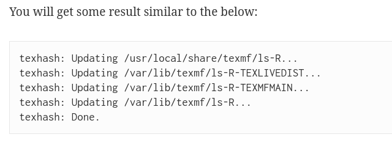
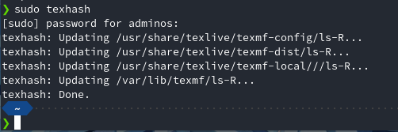

# Instalando lyx on fedora 2024

En este ano me vuelvo a encontrar cosas interesantes al tratar de usar el formato en IEEE de latex.

Instalacion de latex

primero esto lo obtienes de la pagina de fedora

[HOW TO](https://www.cs.cmu.edu/~steffan/personal/tmp/IEEEtran_HOWTO.pdfhttps:/)

Como dice el siguiente tuto

[instalar latex y texstudio](https://medium.com/@JerssonMendoza/instalar-latex-y-texstudio-en-fedora-ubuntu-y-derivados-kde-neon-f5ccac9c5691)

Nuestro fin no es instalar texstudio pero si latex, combinamos el tuto anterior con el tuto siguiente de la documentacion de fedora

[fedora docs](https://docs.fedoraproject.org/en-US/neurofedora/latex/https:/)

Si seguimos lo que dice en este blog [IEEEtran.cls](https://adnan.quaium.com/blog/3478)



pero en nuestro caso es



por tanto nos descargamos aqui usando el siguiente comando

```
❯ cd /usr/shar/texlive/texmf-config
❯ sudo wget https://ece.iisc.ac.in/\~spcom/2024/img/IEEEtran.cls
```

Una vez esto esta descargado en la ubicacion senalada, entonces volvemos a ejecutar el comando

```
❯ sudo texhash
```

Para usar la plantilla de IEEE podemos usar este link donde obtenemos una buena plantilla 

**[IEEE template wordx](https://www.google.com/url?sa=t&source=web&rct=j&opi=89978449&url=https://ieeeaccess.ieee.org/wp-content/uploads/2024/04/Access-Template-2024.docx&ved=2ahUKEwj_xv2kp-6HAxXSVTABHbLbFsUQFnoECAsQAQ&usg=AOvVaw0o2Ht_woHCjRkusyI8OboI)**
