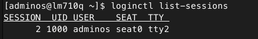

COMPROBAR SI ESTOY USANDO WAYLAND O X11
------------------------------------------------
Hay que comprobar si estoy usando wayland y org


## METHOD 1
Usar loginctl para mirar nuestra ID de sesion y:

```shell
    loginctl show-session [ID de sesión] -p Type
```
Aunque aqui tuve un problema, ya que no se cual es el id de session para eso utilice lo que me indica el comando de loginctl en la cual tenemos tres opciones


de las cuales escogi la que dice list-session 

```shell
    loginctl list-session
```
Ahora si  todo funciono, mira lo que me salio



## METHOD 2
Este metodo es mas rapido sin tanta vuelta, pero igual te lo comparto quiza te interese.

```shell
    >echo $XDG_SESSION_TYPE
```


BIBLIOGRAFIA
---------------------------------------------------------------------------------------
[METHOD](https://notfrom.wordpress.com/2017/04/08/comprobar-si-estamos-usando-xorg-o-wayland/)