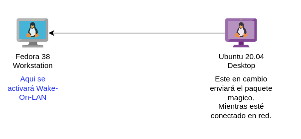
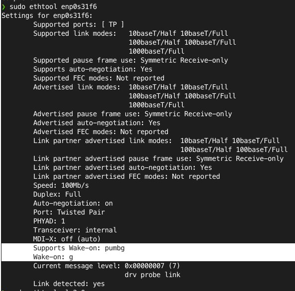

ENABLE WAKEONLAN ON FEDORA 
------------------------------------------------
Lo primero es hablar de la introduccion a esta tecnologia y comprender algunas interrogantes.

¿Qué es el wake-on-lan? Es una forma de activar un PC remotamente, sin tener que estar en el sitio.

¿Por qué lo usamos? Porque nos gusta trabajar desde cualquier lugar del mundo y no hay manera de conectarnos.

¿Cómo funciona? Se activa mediante un paquete de red que se envía por UDP (User Datagram Protocol)

Ahora vamos a graficar nuestro escenario de prueba

## REQUERIMIENTOS

Necesitaremos dos computadores uno en el se activará wake on lan y el otro que es el que enviará el paquete magico al primer PC a través de la red cableada.


Diagrama:


## EN EL SERVIDOR
Verificar que esté conectado en red.
Verificar que este activo en la shell el soporte a wakeonlan de la bios.
Una vez esté activado en la bios wakeonlan en la shell lanzar el siguiente comando.


```shell
    sudo dnf install ethtool
```
Con la herramienta ethtool vamos a comprobar que la interface ethernet del servidor soporte wakeonlan




## METHOD 2
Este metodo es mas rapido sin tanta vuelta, pero igual te lo comparto quiza te interese.

```shell
    >echo $XDG_SESSION_TYPE
```


BIBLIOGRAFIA
---------------------------------------------------------------------------------------
[METHOD](https://notfrom.wordpress.com/2017/04/08/comprobar-si-estamos-usando-xorg-o-wayland/)