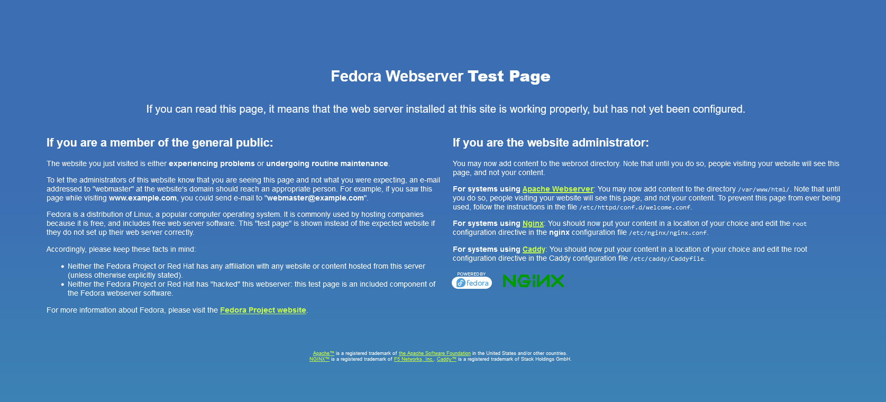
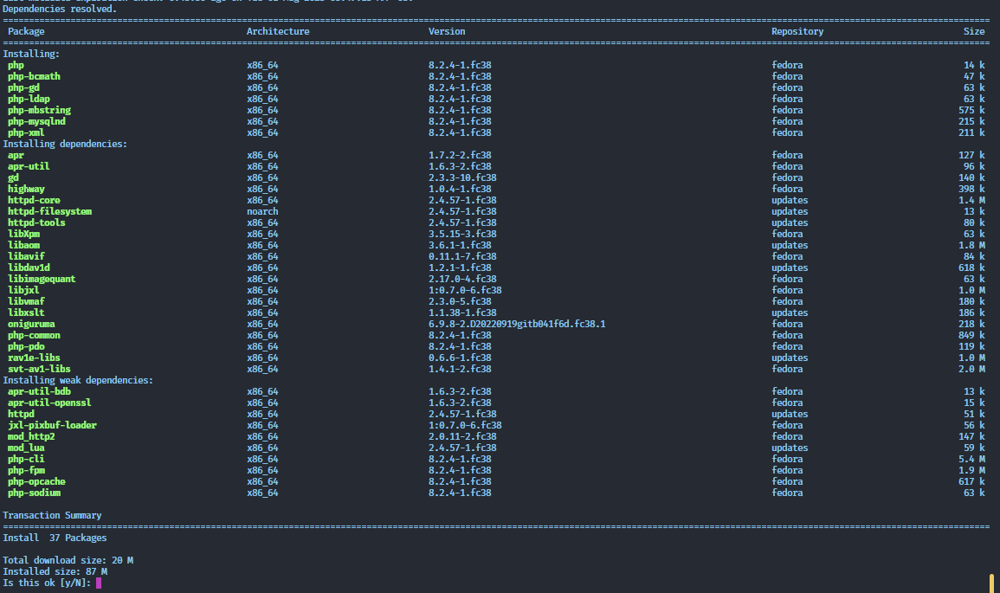
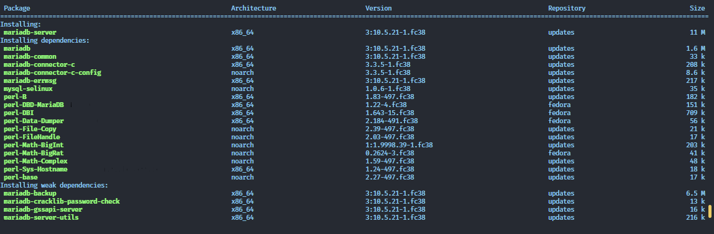
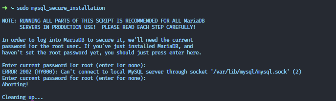
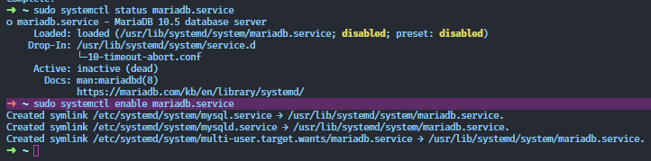

How to install zabbix on fedora 
------------------------------------------------
Pues este sitio sera util para poder describir el proceso de instalacion de zabbix sobre fedora.

## INTRODUCCION
Tratare de seguir varias guias hasta llegar a la guia definitiva para fedora, al parecer no existe la definitiva

## Install web server
En nuestro caso estamos escogiendo nginx el preferido para mis despliegues

```shell
sudo dnf -y install nginx
```

Enter y at the prompt to confirm that you want to install the package.

After the installation completes, run the following commands to enable and start
the service. These commands start Nginx and configure it to start up when the
server does.

```shell
sudo systemctl enable nginx
sudo systemctl start nginx
```
### Open the firewall for nginx

```shell
sudo firewall-cmd --permanent --add-service=http
sudo firewall-cmd --permanent --add-service=https
```
Reload to apply new settings
```shell
sudo firewall-cmd --reload
```

Si todo salio bien, veremos la siguiente ventana en el navegador


## Install php libraries
Como era de esperarse zabbix esta construido con php, por tanto hay que instalar las librerias necesarias para su ejecucion

```shell
sudo dnf install php-8.2.4-1.fc38.x86_64 php-mysqlnd-8.2.4-1.fc38.x86_64 php-ldap-8.2.4-1.fc38.x86_64 php-bcmath-8.2.4-1.fc38.x86_64 php-mbstring-8.2.4-1.fc38.x86_64 php-gd-8.2.4-1.fc38.x86_64 php-gd-8.2.4-1.fc38.x86_64 php-xml-8.2.4-1.fc38.x86_64
```



### Modificar el archivo php.ini


El archivo php.ini, contiene directivas para el uso de php al desplegarse la aplicacion en php, en esta caso zabbix
#### Se recomienda hacer un backup
```bash
sudo cp -p /etc/php.ini{,.bkp}
```

Para modificar el archivo `php.ini` se debe ingresar a este con un editor en este caso nvim

```bash
sudo nvim /etc/php.ini
```

Encontramos las siguientes lineas que debemos cambiar:

```text
post_max_size = 16M
upload_max_filesize = 2M
max_execution_time 300
max_input_time = 300
memory_limit 128M
session.auto_start = 0
mbstring.func_overload = 0
date.timezone = America/Guayaquil
```
## Install Database
```shell
sudo dnf install mariadb-server
```
Si todo va bien veremos los siguientes paquetes instalados

[optional]
```shell
sudo dnf install mariadb-server-3:10.5.18-1.fc38.x86_64 mariadb-3:10.5.18-1.fc38.x86_64 
```
En el caso que hayas instalado los paquetes anteriores y no hayas iniciado el servicio de mariadb, pues es esto lo que te pasar[a]


### Levantar el servicio de la base de datos
```shell
sudo systemctl enable mariadb.service 
```


### Configurando Mariadb

```shell
sudo mysql_secure_installation       
```

>NOTE: RUNNING ALL PARTS OF THIS SCRIPT IS RECOMMENDED FOR ALL MariaDB
      SERVERS IN PRODUCTION USE!  PLEASE READ EACH STEP CAREFULLY!
>
>In order to log into MariaDB to secure it, we'll need the current
>password for the root user. If you've just installed MariaDB, and
>haven't set the root password yet, you should just press enter here.
>
>Enter current password for root (enter for none): 
>OK, successfully used password, moving on...
>
>Setting the root password or using the unix_socket ensures that nobody
>can log into the MariaDB root user without the proper authorisation.
>
>You already have your root account protected, so you can safely answer 'n'.
>
>>Switch to unix_socket authentication [Y/n] **n**
> ... skipping.
>
>You already have your root account protected, so you can safely answer 'n'.
>
>>Change the root password? [Y/n] n
> ... skipping.
>
>By default, a MariaDB installation has an anonymous user, allowing anyone
>to log into MariaDB without having to have a user account created for
>them.  This is intended only for testing, and to make the installation
>go a bit smoother.  You should remove them before moving into a
>production environment.
>
>>Remove anonymous users? [Y/n] Y
> ... Success!
>
>Normally, root should only be allowed to connect from 'localhost'.  This
>ensures that someone cannot guess at the root password from the network.
>
>>Disallow root login remotely? [Y/n] Y
> ... Success!
>
>By default, MariaDB comes with a database named 'test' that anyone can
>access.  This is also intended only for testing, and should be removed
>before moving into a production environment.
>
>>Remove test database and access to it? [Y/n] Y
> - Dropping test database...
> ... Success!
> - Removing privileges on test database...
> ... Success!
>
>Reloading the privilege tables will ensure that all changes made so far
>will take effect immediately.
>
>>Reload privilege tables now? [Y/n] Y
> ... Success!
>
>Cleaning up...
>
>All done!  If you've completed all of the above steps, your MariaDB
>installation should now be secure.
>
>Thanks for using MariaDB!



## BIBLIOGRAFIA

[tutorial para centOS](https://www.tecmint.com/install-and-configure-zabbix-monitoring-on-debian-centos-rhel/)

[documentation official zabbix database](https://www.zabbix.com/documentation/6.4/en/manual/appendix/install/db_scripts)

[zabbix packages](https://www.zabbix.com/download?zabbix=6.4&os_distribution=red_hat_enterprise_linux&os_version=9&components=server_frontend_agent&db=mysql&ws=apache)

