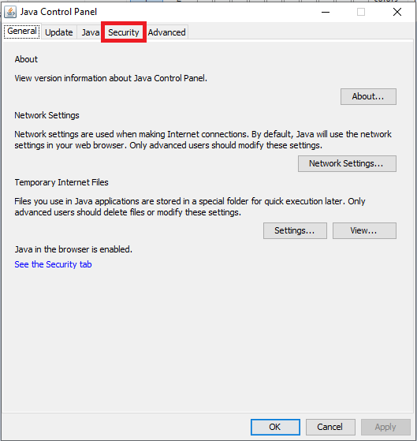
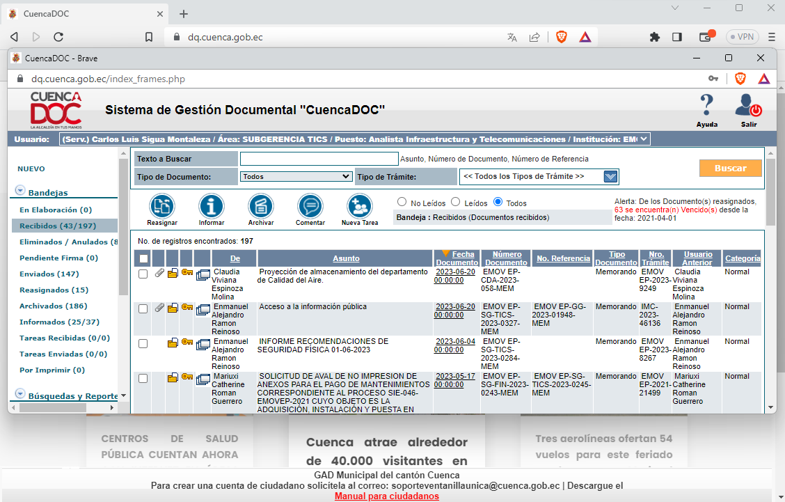
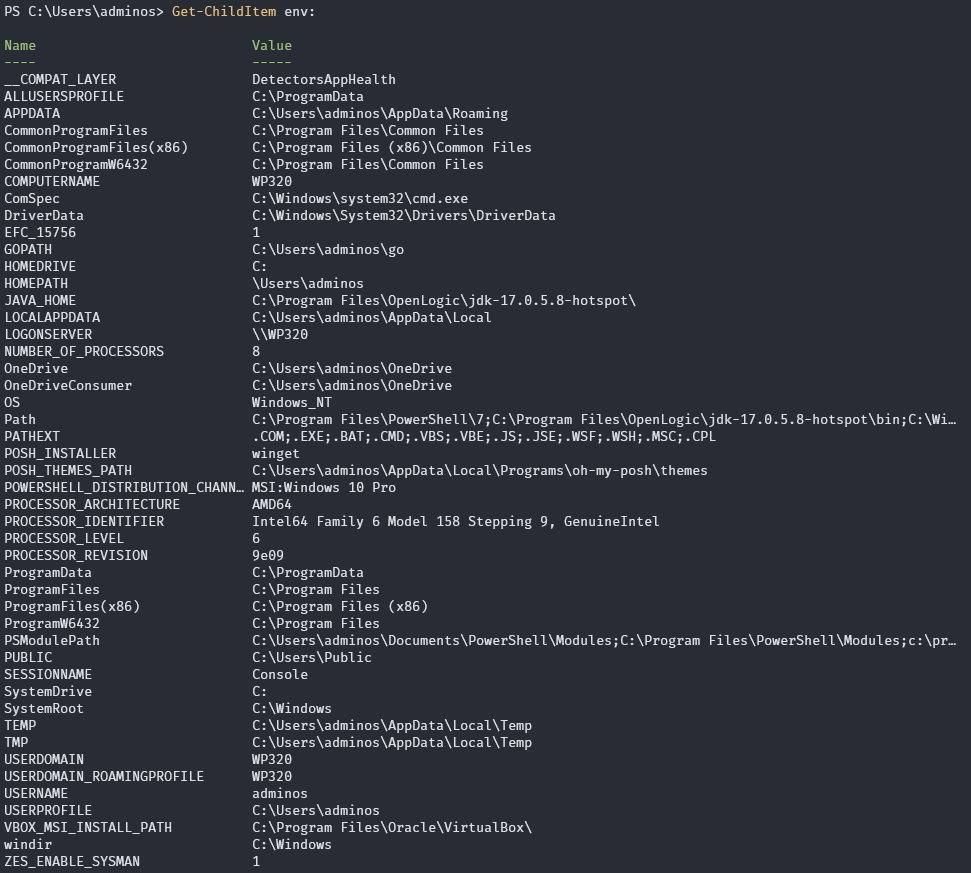
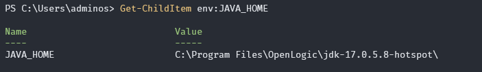

CONFIGURE JAVA 17 
------------------------------------------------------------------------
Como es conocido por este año trabajo en el sector publico muy para mi pesar lucho contra marea.

Pero bueno quiero utilizar java 17 pero me he topado que ya no hay con java 17 el aplicativo para windows llamado java control panel en el cual podias configurar sitios de confianza para java, comparto la siguiente imagen si queda alguna duda.



Este aplicativo era muy util pero siempre tenemos que mejorar nocierto y no podemos quedarnos con java 11 para toda la vida hay que avanzar (aguas banco central y quipux de cuenca)

El sistema de gestion documental del GAD, como se puede observar es una belleza, ni facebook ni twitter le llegan a la talla.



Al parecer tenemos que configurar por linea de comandos o un archivo que se encuentra en java 

## Encontrar la ubicacion del java.policy

En nuestro caso lo encontramos en 
> C:\Program Files\OpenLogic\jdk-17.0.5.8-hotspot\conf\security


>// For example, to grant permission to accept all for site dq.cuenca.gob.ec
>grant codeBase "https://dq.cuenca.gob.ec" {
>	permission java.security.AllPermission;
>};

C:\Program Files\OpenLogic\jdk-17.0.5.8-hotspot\conf\security


grant codeBase "file:${jnlpx.home}/javaws.jar" {
    permission java.security.AllPermission;
};

Despues de tantas pruebas no lo he logrado al parecer el problema es la implementacion de la aplicacion JAVA Web Start launch el cual es el archivo javaws.exe que por ahora solo lo tiene la version de jdk 8 y no las nuevas ojala esto no se danie.

## Ver las variables de entorno existentes en windows

- Listar variables de entorno en windows

```shell
    Get-ChildItem Env:
```
o tambien puedes hacerlo de esta manera

```shell
     [Environment]::GetEnvironmentVariable('JAVA_HOME', 'Machine')
```


Si dentro de esas variables no puedes ver a JAVA_HOME, habrá que definirla y configurarla.


### ver el valor de una sola variable




# Crear una nueva variable de entorno llamada JAVA_HOME
Set-Item -Path 'Env:JAVA_HOME' -Value 'C:\Program Files\Java\jdk-17'