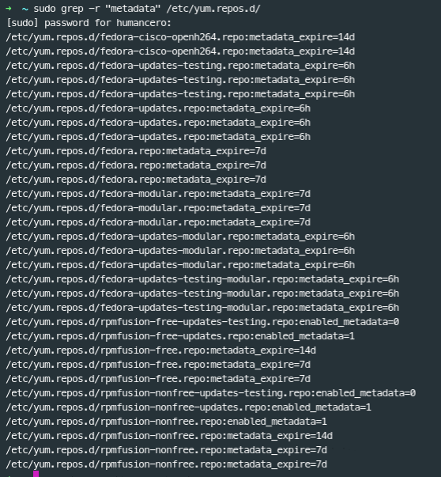

TIPS FOR SEARCHING
------------------------------------------------
Sobre este archivo mostrare algunos tips que me son utiles para linux
## INTRODUCCION
Algunos comandos en linux nos ayudan a ejecutar algunas cosas en linux 


### Tips Linux Search commands
Siempre necesitaremos buscar en linux alguna o algunas palabras y a veces presumimos un directorio en donde buscar, pues lo intentaremos de la siguiente manera.

### grep
```shell
sudo grep -r "palabra" /ruta/del/directorio
```
Donde ruta del directorio es obviamente el directorio donde presumimos puede tener la palabra algun archivo dentro de ese directorio.

Veamos un ejemplo
Quiero buscar la la palabra metadata dentro del directorio 
```shell
➜  ~ sudo grep -r "metadata" /etc/yum.repos.d
```


### find + grep
Otra forma de hacerlo es utilizando el comando find para encontrar todos los archivos en el directorio y luego pasarlos como entrada al comando grep:
```shell
find /ruta/del/directorio -type f -exec grep -H "palabra" {} +
```

### ack
Si tienes ack-grep instalado en tu sistema (un reemplazo más avanzado de grep), puedes usarlo de manera similar para realizar la búsqueda:

si no lo tienes instalado en fedora es:
```shell
➜  ~ sudo dnf install ack-3.7.0-1.fc38.noarch 
```

#### Usando ack

- Sintaxis basica

```shell
ack "palabra" /ruta/del/directorio
```
Para un ejemplo simple puedes posicionarte en el directorio donde desees buscar la palabra, ejemplo de esto nos posicionamos dentro del directorio de /etc/yum.repos.d 
```shell
➜  ~ cd /etc/yum.repos.d 
➜  yum.repos.d ack metadata
```
- LINKS
https://www.atlantic.net/vps-hosting/how-to-install-and-use-the-ack-command-in-linux/

https://www.digitalocean.com/community/tutorials/how-to-install-and-use-ack-a-grep-replacement-for-developers-on-ubuntu-14-04

https://www.linode.com/docs/guides/how-to-use-ack-command/


### ripgrep
Si tienes instalado ripgrep (rg), otra herramienta más rápida que grep para la búsqueda, puedes usarla así:
```shell
rg "palabra" /ruta/del/directorio
```

## BIBLIOGRAFIA

[Tecmint](https://www.tecmint.com/35-practical-examples-of-linux-find-command/)
[FREECODECAMP](https://www.freecodecamp.org/news/how-to-search-for-files-from-the-linux-command-line/)
[IONOS](https://www.ionos.es/digitalguide/servidores/configuracion/comando-linux-find/)
